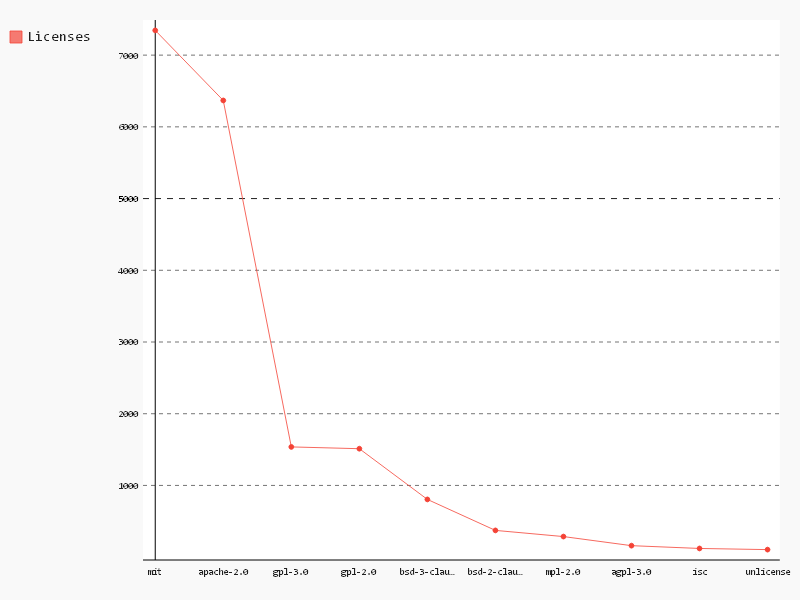

# Licenses

```sql
-- License,Count
SELECT
  license,
  COUNT(*) count
FROM (
  SELECT
    files.repo_name AS repo_name,
    licenses.license AS license
  FROM
    [puppet.puppet_files] AS files
  JOIN
    [bigquery-public-data:github_repos.licenses] AS licenses
  ON
    files.repo_name = licenses.repo_name
  GROUP BY
    repo_name,
    license )
GROUP BY
  1
ORDER BY
  count DESC
LIMIT
  10

```

| License      | Count |
|--------------|-------|
| mit          | 7345  |
| apache-2.0   | 6368  |
| gpl-3.0      | 1537  |
| gpl-2.0      | 1512  |
| bsd-3-clause | 805   |
| bsd-2-clause | 373   |
| mpl-2.0      | 287   |
| agpl-3.0     | 160   |
| isc          | 121   |
| unlicense    | 105   |

