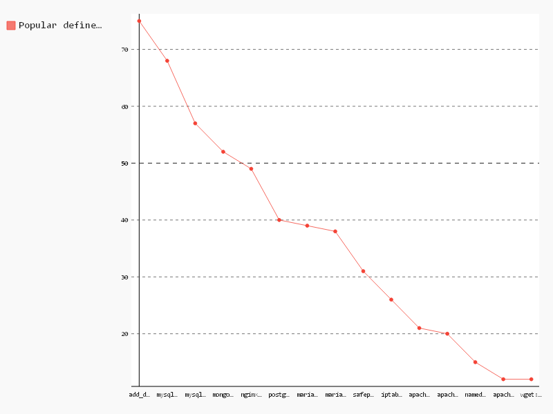

# Popular defined type names

```sql
-- Name,Count
SELECT
  package,
  COUNT(*) count
FROM (
  SELECT
    REGEXP_EXTRACT(line, r'define (\S+) \(') package,
    id
  FROM (
    SELECT
      SPLIT(content, '\n') line,
      id
    FROM
      [puppet.puppet_content]
    WHERE
      content CONTAINS 'class' )
  GROUP BY
    package,
    id )
WHERE
  package IS NOT NULL
GROUP BY
  1
ORDER BY
  count DESC
LIMIT
  15

```

| Name                       | Count |
|----------------------------|-------|
| add_dotdeb                 | 75    |
| mysql_db                   | 68    |
| mysql_nginx_default_conf   | 57    |
| mongodb_db                 | 52    |
| nginx_vhost                | 49    |
| postgresql_db              | 40    |
| mariadb_db                 | 39    |
| mariadb_nginx_default_conf | 38    |
| safepackage                | 31    |
| iptables_port              | 26    |
| apache::loadmodule         | 21    |
| apache::mod                | 20    |
| namedir_copy               | 15    |
| apache::vhost              | 12    |
| wget::fetch                | 12    |

