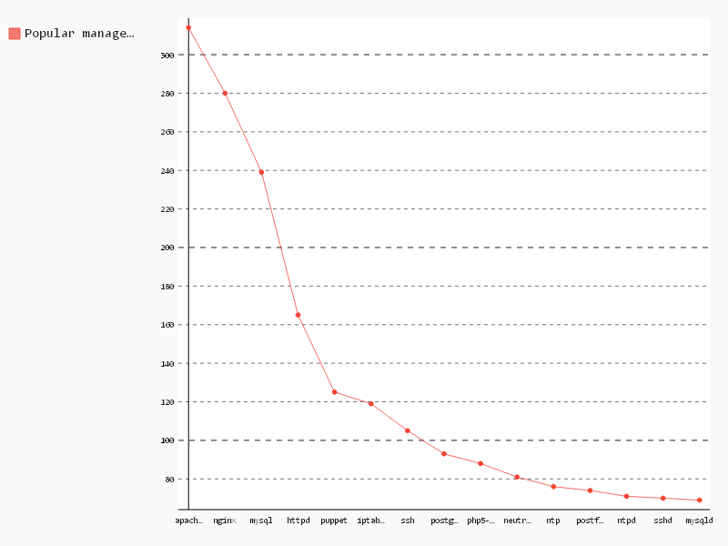

# Popular managed service

```sql
-- Service,Count
SELECT
  name,
  COUNT(*) count
FROM (
  SELECT
    REGEXP_EXTRACT(line, r'service\s?{\s?[\"|\'](\S+)[\"|\']:') name,
    id
  FROM (
    SELECT
      SPLIT(content, '\n') line,
      id
    FROM
      [puppet.puppet_content] )
  GROUP BY
    name,
    id )
WHERE
  name IS NOT NULL
GROUP BY
  1
ORDER BY
  count DESC
LIMIT
  15

```

| Service        | Count |
|----------------|-------|
| apache2        | 314   |
| nginx          | 280   |
| mysql          | 239   |
| httpd          | 165   |
| puppet         | 125   |
| iptables       | 119   |
| ssh            | 105   |
| postgresql     | 93    |
| php5-fpm       | 88    |
| neutron-server | 81    |
| ntp            | 76    |
| postfix        | 74    |
| ntpd           | 71    |
| sshd           | 70    |
| mysqld         | 69    |

