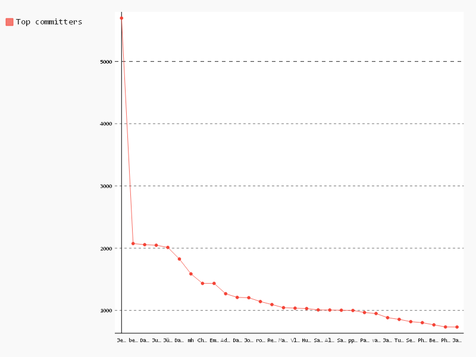

# Top committers

```sql
-- Name,Count
SELECT author_name, COUNT(1) count
FROM [puppet.puppet_commits] AS commits
GROUP BY author_name
ORDER BY count DESC
LIMIT 30

```

| Name                 | Count |
|----------------------|-------|
| Jenkins              | 5697  |
| berrak               | 2074  |
| Dan Bode             | 2056  |
| Juha Erkkilä         | 2047  |
| Jürgen Viljaste      | 2012  |
| David Rose           | 1826  |
| mh                   | 1587  |
| Chris Stasiak        | 1434  |
| Emilien Macchi       | 1434  |
| Adam Breaux          | 1268  |
| Dan Carley           | 1209  |
| Josh Samuelson       | 1204  |
| root                 | 1142  |
| Reto Kaiser          | 1094  |
| Matt Bostock         | 1044  |
| Vladimir Kuklin      | 1036  |
| Hunter Haugen        | 1030  |
| Samuli Seppänen      | 1008  |
| Alex Muller          | 1006  |
| Sam J Sharpe         | 1003  |
| ppp0                 | 999   |
| Paul Gear            | 966   |
| varac                | 950   |
| James Fryman         | 883   |
| Tuomas Räsänen       | 856   |
| Sebastien Badia      | 819   |
| Philippe M. Chiasson | 803   |
| Ben Ford             | 768   |
| Philip Potter        | 734   |
| James Abley          | 733   |

