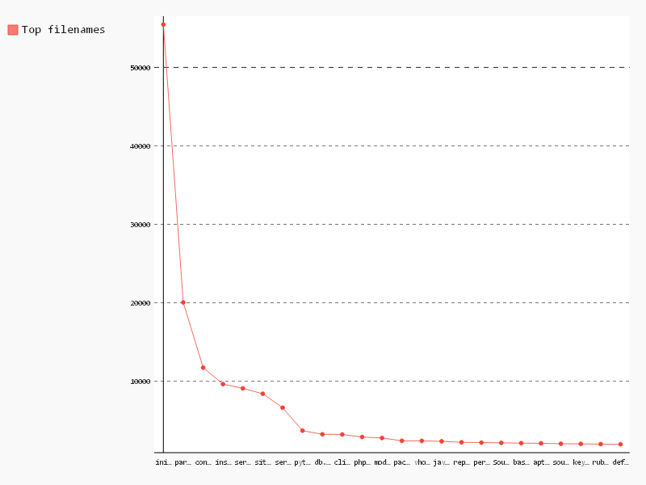

# Top filenames

```sql
-- Name,Count
SELECT TOP(filename, 24), COUNT(*) as n
FROM (
    SELECT LAST(SPLIT(path, '/')) as filename
    FROM [puppet.puppet_files]
)

```

| Name       | Count |
|------------|-------|
| init.pp    | 55459 |
| params.pp  | 20042 |
| config.pp  | 11734 |
| install.pp | 9630  |
| service.pp | 9088  |
| site.pp    | 8403  |
| server.pp  | 6623  |
| python.pp  | 3701  |
| db.pp      | 3239  |
| client.pp  | 3214  |
| php.pp     | 2893  |
| module.pp  | 2770  |
| package.pp | 2409  |
| vhost.pp   | 2399  |
| java.pp    | 2341  |
| repo.pp    | 2218  |
| perl.pp    | 2176  |
| Sources.pp | 2149  |
| base.pp    | 2109  |
| apt.pp     | 2087  |
| source.pp  | 2033  |
| key.pp     | 2014  |
| ruby.pp    | 1986  |
| default.pp | 1965  |

