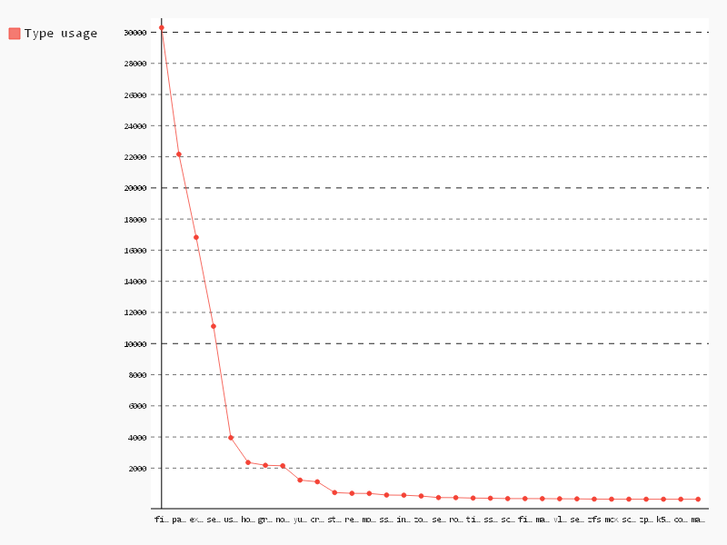

# Type usage

```sql
-- Type,Count
SELECT
  type,
  COUNT(*) count
FROM (
  SELECT
    REGEXP_EXTRACT(line, r'(augeus|computer|cron|exec|file|filebucket|group|host|interface|k5login|macauthorization|mailalias|maillist|mcx|mount|notify|package|resources|router|schedule|scheduled_task|selboolean|selmodule|service|ssh_authorized_key|sshkey|stage|tidy|user|vlan|yumrepo|zfs|zone|zpool)\s?{') type,
    id
  FROM (
    SELECT
      SPLIT(content, '\n') line,
      id
    FROM
      [puppet.puppet_content]
  )
  GROUP BY
    type,
    id )
WHERE
  type IS NOT NULL
GROUP BY
  1
ORDER BY
  count DESC

```

| Type               | Count |
|--------------------|-------|
| file               | 30298 |
| package            | 22162 |
| exec               | 16825 |
| service            | 11112 |
| user               | 3951  |
| host               | 2361  |
| group              | 2181  |
| notify             | 2151  |
| yumrepo            | 1229  |
| cron               | 1122  |
| stage              | 429   |
| resources          | 380   |
| mount              | 373   |
| ssh_authorized_key | 271   |
| interface          | 260   |
| zone               | 207   |
| selboolean         | 108   |
| router             | 103   |
| tidy               | 76    |
| sshkey             | 66    |
| schedule           | 42    |
| filebucket         | 42    |
| mailalias          | 40    |
| vlan               | 31    |
| selmodule          | 25    |
| zfs                | 11    |
| mcx                | 6     |
| scheduled_task     | 5     |
| zpool              | 3     |
| k5login            | 3     |
| computer           | 2     |
| maillist           | 1     |

