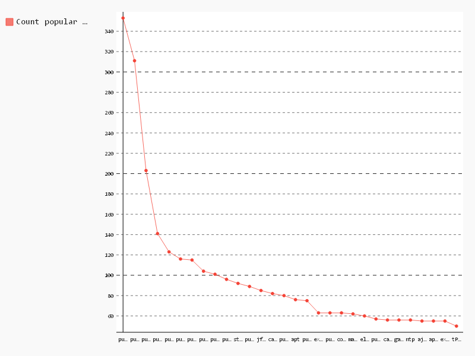

# Count popular modules

```sql
-- Module,Count
SELECT package, COUNT(*) count
FROM (
  SELECT REGEXP_EXTRACT(line, r'mod [\'|"](.*)[\'|"]') package, id
  FROM (
    SELECT SPLIT(content, '\n') line, id
    FROM [puppet.puppetfile_content]
    WHERE content CONTAINS 'mod' )
    GROUP BY package, id
  )
WHERE package IS NOT NULL
GROUP BY 1
ORDER BY count DESC
LIMIT 30;

```

| Module                                                             | Count |
|--------------------------------------------------------------------|-------|
| puppet-#{name}", :path => "#{ENV['HOME']}/src/boxen/puppet-#{name} | 353   |
| puppetlabs/stdlib                                                  | 311   |
| puppetlabs/apt                                                     | 203   |
| puppetlabs/concat                                                  | 141   |
| puppetlabs/mysql                                                   | 123   |
| puppetlabs/apache                                                  | 116   |
| puppetlabs/ntp                                                     | 115   |
| puppetlabs/vcsrepo                                                 | 104   |
| puppetlabs/firewall                                                | 101   |
| puppetlabs/java                                                    | 96    |
| stdlib                                                             | 92    |
| puppetlabs/postgresql                                              | 89    |
| jfryman/nginx                                                      | 85    |
| cargomedia/apt                                                     | 82    |
| puppetlabs/inifile                                                 | 80    |
| apt                                                                | 76    |
| puppetlabs/rabbitmq                                                | 75    |
| example42/puppi                                                    | 63    |
| puppetlabs/mongodb                                                 | 63    |
| concat                                                             | 63    |
| maestrodev/rvm                                                     | 62    |
| elasticsearch/elasticsearch                                        | 60    |
| puppetlabs-stdlib                                                  | 57    |
| cargomedia/monit                                                   | 56    |
| garethr/erlang                                                     | 56    |
| ntp                                                                | 56    |
| ajcrowe/supervisord                                                | 55    |
| apache                                                             | 55    |
| example42/yum                                                      | 55    |
| tPl0ch/composer                                                    | 50    |

