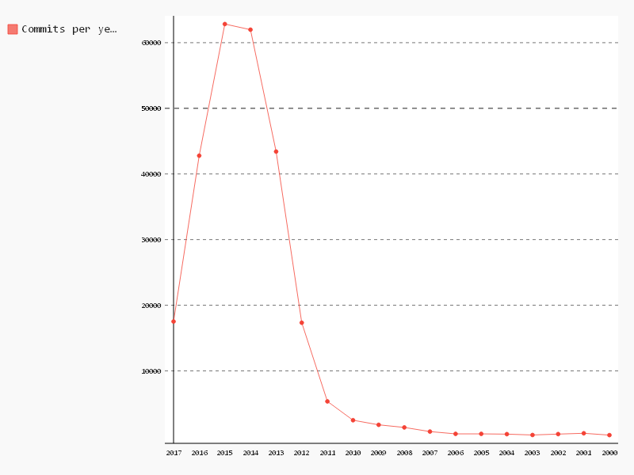

# Commits per year

```sql
-- Year,Commits
SELECT author_date, COUNT(*) as commits
FROM (
  SELECT YEAR(author_date) as author_date
  FROM [puppet.puppet_commits]
)
GROUP BY author_date
ORDER BY author_date DESC

```

| Year | Commits |
|------|---------|
| 2017 | 17520   |
| 2016 | 42783   |
| 2015 | 62838   |
| 2014 | 61982   |
| 2013 | 43410   |
| 2012 | 17335   |
| 2011 | 5348    |
| 2010 | 2479    |
| 2009 | 1778    |
| 2008 | 1382    |
| 2007 | 749     |
| 2006 | 402     |
| 2005 | 401     |
| 2004 | 360     |
| 2003 | 229     |
| 2002 | 367     |
| 2001 | 490     |
| 2000 | 211     |

